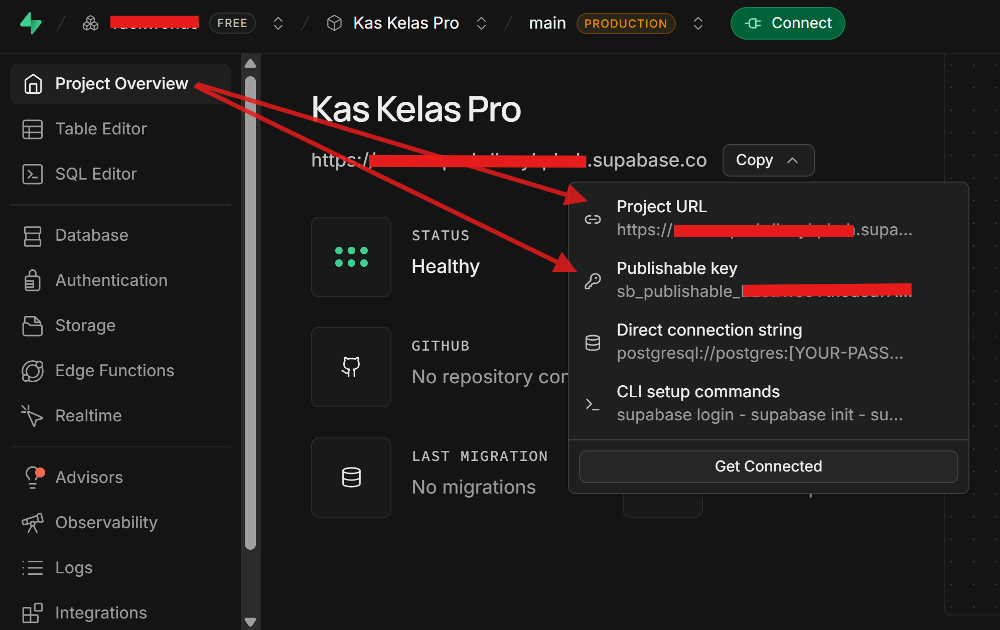

# 💰 Kas Kelas Pro

**Dashboard kas kelas open-source berbasis Next.js, Supabase, dan Vercel** — untuk bendahara kelas yang ingin mengelola iuran (harian maupun bulanan), memantau tunggakan, dan berbagi akses ke siswa/orang tua secara aman, tanpa spreadsheet manual.

[](./LICENSE)
[](https://nextjs.org)
[](https://supabase.com)
[](https://vercel.com/new/clone?repository-url=https%3A%2F%2Fgithub.com%2Fprojectronic%2FKasKelasPro)
[]()

> 🚧 **Status: dalam pengembangan aktif.** Struktur database, halaman, dan tombol deploy akan terus diperbarui. Lihat [Roadmap](#-roadmap) untuk progres.

---

## 📖 Daftar Isi

- [💰 Kas Kelas Pro](#-kas-kelas-pro)
  - [📖 Daftar Isi](#-daftar-isi)
  - [🎯 Kenapa Kas Kelas Pro?](#-kenapa-kas-kelas-pro)
  - [✨ Fitur](#-fitur)
  - [🧩 Tech Stack](#-tech-stack)
  - [🔐 Role \& Hak Akses](#-role--hak-akses)
  - [🚀 Mulai Cepat (Deploy Sendiri)](#-mulai-cepat-deploy-sendiri)
    - [1. Setup Supabase](#1-setup-supabase)
    - [2. Deploy ke Vercel](#2-deploy-ke-vercel)
    - [3. Sambungkan balik ke Supabase](#3-sambungkan-balik-ke-supabase)
    - [4. Pemakaian pertama](#4-pemakaian-pertama)
  - [🔑 Environment Variables](#-environment-variables)
  - [🛡️ Privasi \& Tanggung Jawab](#️-privasi--tanggung-jawab)
  - [🗺️ Roadmap](#️-roadmap)
  - [🤝 Kontribusi](#-kontribusi)
  - [🙏 Kredit](#-kredit)
  - [📄 Lisensi](#-lisensi)

---

## 🎯 Kenapa Kas Kelas Pro?

Bendahara kelas biasanya mencatat kas di buku, grup chat, atau spreadsheet — gampang hilang, sulit diaudit, dan rawan salah hitung. **KasKelasPro** dibuat supaya satu kelas bisa punya "sistem keuangan mini" sendiri:

- Data tersimpan aman di **Supabase** (Postgres + Auth + Row Level Security), bukan cuma di browser satu orang.
- Bisa **di-deploy gratis** oleh siapa saja ke akun **Vercel** + **Supabase** masing-masing dalam hitungan menit.
- Siswa dan orang tua bisa diberi akses **lihat-saja** tanpa perlu takut data diubah sembarangan.

## ✨ Fitur

| Fitur | Keterangan |
|---|---|
| 🗓️ **Mode iuran fleksibel** | Pilih saat setup: **iuran harian** (misal Rp1.000/hari sekolah) atau **iuran bulanan** (nominal tetap per bulan) |
| ⚙️ **Pengaturan besar iuran** | Nominal iuran diatur lewat halaman Settings, tidak hardcode di kode. Bisa juga atur **pengecualian nominal per bulan/periode tertentu** (mis. bulan pertama beda karena ada biaya pendaftaran) dan **tanggal mulai kas** (biasanya awal tahun ajaran) — tunggakan dihitung dari situ, atau dari tanggal gabung anggota kalau lebih belakangan |
| ✅ **Catat pembayaran multi-bulan + bayar di muka** | Mode bulanan: pilih anggota, sistem otomatis tampilkan checklist bulan yang belum lunas dengan nominalnya — tinggal centang yang mau dibayar sekaligus. Ada juga opsi **bayar di muka** untuk 12 bulan ke depan (belum jatuh tempo), buat anggota yang mau bayar borongan di awal |
| 📅 **Pembayaran harian by rentang tanggal** | Mode harian: pilih tanggal mulai & akhir, sistem otomatis buat checklist tiap hari sekolah di rentang itu (default 1 hari) — **akhir pekan dan hari libur otomatis dikecualikan** |
| 🎉 **Hari Libur** | Ambil kalender libur nasional otomatis lewat API (Nager.Date), atau tambah/hapus manual (mis. libur semester) — dipakai form pembayaran harian di atas supaya tidak salah hitung |
| 👥 **Manajemen anggota** | Tambah/edit data siswa, termasuk **nama, email, telepon siswa, dan nama/email/telepon orang tua/wali**. Nomor telepon jadi link WhatsApp — klik langsung buka `wa.me` |
| 🏷️ **Nama kelas & sekolah dinamis** | Judul tab browser dan halaman login/daftar otomatis pakai **Nama Kelas** dari Pengaturan, bukan hardcode "KasKelasPro". Sidebar menampilkan **Nama Kelas** sebagai judul dan **Nama Sekolah** sebagai subjudul |
| 🗂️ **Sidebar navigasi responsif** | Sidebar collapsible (bisa diciutkan jadi ikon saja) di desktop, otomatis jadi drawer geser di mobile — beserta skeleton loading state di tiap halaman |
| 💯 **Format ribuan otomatis** | Semua input nominal (iuran, pengecualian, pembayaran, penarikan, transfer) tampil dengan pemisah ribuan (mis. `10.000`) selagi diketik |
| 📝 **Pendaftaran terbuka + approval** | Siapa saja bisa daftar sendiri sebagai **siswa** atau **orang tua/wali** (akun & password terpisah), tapi menunggu **approval admin/editor** sebelum bisa mengakses data kelas — bukan whitelist tertutup |
| 👨‍👩‍👧 **Siswa & orang tua akun terpisah** | Dicocokkan otomatis ke anggota yang sama lewat nama siswa, supaya tidak dihitung dobel di jumlah anggota/tunggakan; admin bisa membetulkan lewat **Edit Anggota** kalau salah sambung |
| 🔐 **Role management** | `admin`, `editor` (bendahara/pengurus — bisa input transaksi & kelola data serta approve pendaftaran), `viewer` (siswa/orang tua yang sudah di-approve — lihat saldo & rekap saja) |
| 🏷️ **Jabatan custom** | Admin bisa kasih label bebas ("Ketua", "Bendahara", "Sekretaris", dst) ke akun admin/editor — tampil di header dan halaman Pengguna. **Catatan:** ini label tampilan saja, hak aksesnya tetap dari role di atas (lihat [Role & Hak Akses](#-role--hak-akses) untuk kenapa) |
| 💵 **Dompet & Bank** | Pisah saldo kas tunai dan saldo bank, dengan mutasi antar-dompet |
| 📊 **Rekap & tunggakan otomatis** | Hitung tunggakan berdasarkan mode iuran yang aktif |
| 🧾 **Riwayat penarikan** | Catat penggunaan dana lengkap dengan alasan, sebagai bukti pertanggungjawaban |
| 🔑 **Reset password mandiri** | Anggota bisa reset password sendiri lewat email (halaman Lupa Password), admin juga bisa memicu reset untuk akun tertentu |
| 🌗 **Dark/light mode** | Toggle tema (Terang/Gelap/Sistem) di pojok kanan atas setiap halaman, tersimpan sesuai preferensi browser |
| 🕒 **Riwayat aktivitas** | Log siapa melakukan apa dan kapan (pembayaran, penarikan/transfer dana, approval pendaftaran) — halaman Riwayat, admin/editor saja |

## 🧩 Tech Stack

- **[Next.js](https://nextjs.org)** — frontend + API routes
- **[Supabase](https://supabase.com)** — Postgres database, Auth, dan Row Level Security untuk role management
- **[Vercel](https://vercel.com)** — hosting & CI/CD

## 🔐 Role & Hak Akses

| Aksi | Admin | Editor | Viewer (approved) |
|---|:---:|:---:|:---:|
| Melihat dashboard, saldo, rekap | ✅ | ✅ | ✅ |
| Melihat daftar Anggota | ✅ (lengkap) | ✅ (lengkap) | ✅ (nama & status saja — kontak orang tua siswa lain disembunyikan) |
| Input transaksi kas / iuran | ✅ | ✅ | ❌ |
| Tambah/edit data anggota | ✅ | ✅ | ❌ |
| **Approve pendaftaran baru** | ✅ | ✅ | ❌ |
| Ubah pengaturan (nominal iuran, mode harian/bulanan) | ✅ | ❌ | ❌ |
| Kelola role pengguna lain | ✅ | ❌ | ❌ |
| Reset password pengguna lain | ✅ | ❌ | ❌ |

Akun yang baru daftar berstatus **pending** — tidak bisa mengakses data apa pun (hanya lihat layar "menunggu persetujuan") sampai di-approve oleh admin/editor lewat halaman **Pengguna**.

Semua orang (termasuk yang belum login) bisa reset password mereka sendiri lewat halaman **Lupa Password** di `/login`.

### Kenapa cuma 3 role, bukan role bebas buat admin?

Role di atas (`admin`/`editor`/`viewer`) itu tetap — bukan sesuatu yang admin bisa tambah/kurangi sendiri lewat UI. Yang bisa dikustomisasi cuma **label tampilan** (field "Jabatan" di halaman Pengguna, mis. "Ketua", "Bendahara", "Sekretaris") yang ditempel ke akun `admin`/`editor`, tanpa mengubah hak aksesnya sama sekali.

Alasannya: hak akses ditegakkan lewat RLS (Row Level Security) di database, bukan di kode aplikasi — jadi role "penuh dinamis" (admin bikin role baru + pilih sendiri izin apa saja per role) butuh desain ulang seluruh policy RLS di `supabase/schema.sql` dari yang sekarang cek `role = 'admin'/'editor'` jadi cek tabel permission terpisah. Itu perubahan besar dan berisiko (salah desain = celah keamanan data keuangan), jadi sengaja belum dikerjakan tanpa dibahas dulu. Kalau memang dibutuhkan, kabari saja.

## 🚀 Mulai Cepat (Deploy Sendiri)

### 1. Setup Supabase

1. Buat akun/project baru di [supabase.com](https://supabase.com) (gratis).
2. Buka **SQL Editor** di dashboard project → tempel seluruh isi [`supabase/schema.sql`](./supabase/schema.sql) → **Run**. Ini akan membuat semua tabel, RLS policy, trigger pendaftaran, dan fungsi ledger sekaligus.
3. Buka **Project Settings → API**, catat **Project URL** dan **anon/public key** (di dashboard Supabase yang lebih baru namanya **Publishable key**, format `sb_publishable_...` — fungsinya sama persis, tinggal pakai) — dipakai di langkah 3 bagian deploy.

   

4. Buka **Authentication → URL Configuration**, isi **Site URL** dengan domain Vercel kamu nanti (bisa diisi/diubah belakangan setelah deploy jadi tahu domainnya).

### 2. Deploy ke Vercel

[](https://vercel.com/new/clone?repository-url=https%3A%2F%2Fgithub.com%2Fprojectronic%2FKasKelasPro&env=NEXT_PUBLIC_SUPABASE_URL,NEXT_PUBLIC_SUPABASE_ANON_KEY,SUPABASE_SERVICE_ROLE_KEY&envDescription=Kredensial%20dari%20Supabase%20project%20kamu%20(Project%20Settings%20%E2%86%92%20API)&envLink=https%3A%2F%2Fgithub.com%2Fprojectronic%2FKasKelasPro%23-environment-variables&project-name=kaskelaspro&repository-name=kaskelaspro)

1. Klik tombol di atas, hubungkan akun GitHub kamu (Vercel akan membuat fork/clone repo ini ke akunmu).
2. Saat diminta environment variables, isi `NEXT_PUBLIC_SUPABASE_URL` dan `NEXT_PUBLIC_SUPABASE_ANON_KEY` dari langkah Supabase di atas. `SUPABASE_SERVICE_ROLE_KEY` opsional untuk sekarang (isi kalau nanti butuh operasi admin khusus).
3. Klik **Deploy** dan tunggu build selesai.

### 3. Sambungkan balik ke Supabase

1. Setelah deploy sukses, salin domain Vercel kamu (mis. `kaskelaspro-punyaku.vercel.app`).
2. Kembali ke Supabase → **Authentication → URL Configuration** → update **Site URL** dengan domain itu, supaya link konfirmasi email mengarah ke tempat yang benar.

   > ⚠️ **Site URL harus URL lengkap dengan skema `https://`**, contoh: `https://kaskelaspro-punyaku.vercel.app` — bukan cuma `kaskelaspro-punyaku.vercel.app`. Kalau skemanya kelupaan, link konfirmasi email/reset password akan salah arah (browser mendarat di domain `*.supabase.co` dengan error `"requested path is invalid"` alih-alih ke aplikasi kamu).

### 4. Pemakaian pertama

1. Buka domain Vercel kamu → **/signup** → daftar akun pertama. Akun pertama ini **otomatis jadi admin & langsung approved**.
2. Login sebagai admin → **Pengaturan**: atur nama kelas, mode iuran (harian/bulanan), dan nominal default.
3. Sebarkan link `/signup` ke siswa/orang tua. Setiap pendaftar baru berstatus **pending** sampai kamu approve lewat halaman **Pengguna**. (Atau tambahkan anggota manual lewat **Anggota** kalau tidak semua orang akan bikin akun sendiri.)
4. **Pengguna**: kalau perlu, promosikan salah satu akun jadi `editor` (mis. bendahara kedua) lewat halaman ini.

## 🔑 Environment Variables

Salin [`.env.example`](./.env.example) menjadi `.env.local` lalu isi dengan kredensial project Supabase-mu sendiri:

```
NEXT_PUBLIC_SUPABASE_URL=
NEXT_PUBLIC_SUPABASE_ANON_KEY=
SUPABASE_SERVICE_ROLE_KEY=
```

> ⚠️ `SUPABASE_SERVICE_ROLE_KEY` punya akses penuh ke database (bypass RLS). Jangan pernah expose ke client atau commit ke git — file `.env*` sudah masuk `.gitignore`.

## 🛡️ Privasi & Tanggung Jawab

KasKelasPro menyimpan **data pribadi** (nama, email, nomor telepon siswa maupun orang tua/wali). Karena proyek ini open-source dan di-*deploy sendiri* (self-hosted) oleh masing-masing pengguna:

- **Setiap pengelola/deployer bertanggung jawab penuh** atas keamanan, penyimpanan, dan kepatuhan hukum terkait data yang dimasukkan ke instance mereka masing-masing, termasuk kepatuhan terhadap **UU Perlindungan Data Pribadi (UU No. 27 Tahun 2022)**.
- Disarankan meminta persetujuan siswa/orang tua sebelum memasukkan data kontak mereka.
- Proyek ini disediakan **"as is"** tanpa jaminan apa pun (lihat [Lisensi](#-lisensi)) — penulis/kontributor tidak bertanggung jawab atas kebocoran atau penyalahgunaan data pada instance pihak ketiga.

## 🗺️ Roadmap

- [x] Scaffold project Next.js + shadcn/ui + koneksi Supabase
- [x] Skema database (anggota, settings, dues_overrides, payments, wallet_transactions, roles) + RLS policy — lihat [`supabase/schema.sql`](./supabase/schema.sql)
- [x] Autentikasi + pendaftaran terbuka dengan approval admin/editor (bukan whitelist)
- [x] Toggle mode iuran harian/bulanan + pengecualian per periode di Settings
- [x] Halaman input pembayaran iuran & riwayat penarikan/transfer dompet↔bank
- [x] Rekap tunggakan otomatis per anggota, diurutkan dari penunggak terbanyak
- [x] Tombol Deploy to Vercel + panduan setup Supabase step-by-step lengkap
- [x] Halaman kelola role pengguna (ubah viewer/editor/admin dari UI)
- [x] Reset password mandiri (self-service) + reset oleh admin
- [x] Dark/light mode toggle
- [x] Pendaftaran terpisah siswa/orang tua (akun & password sendiri-sendiri), dicocokkan otomatis ke anggota yang sama by nama
- [x] Halaman edit Anggota (betulkan data / salah sambung siswa↔orang tua)
- [x] Tanggal mulai kas di Settings + checklist pembayaran multi-bulan (mode bulanan) + input tanggal di pembayaran/penarikan/transfer
- [x] Halaman Riwayat aktivitas (audit log pembayaran, mutasi dana, approval)
- [x] Nama kelas dinamis di tab & halaman login/daftar, format ribuan di semua input nominal, telepon jadi link WhatsApp, jabatan custom (label saja) untuk admin/editor
- [x] Sidebar navigasi (collapsible di desktop, drawer di mobile) menggantikan top nav bar, beserta skeleton loading state
- [x] Nama Sekolah terpisah dari Nama Kelas di Pengaturan, ditampilkan sebagai subjudul sidebar
- [x] Checklist pembayaran multi-periode untuk mode harian (rentang tanggal mulai/akhir, akhir pekan & hari libur otomatis dikecualikan)
- [x] Bayar di muka (prepayment) untuk mode bulanan — checklist bulan-bulan berikutnya yang belum jatuh tempo, bukan cuma tunggakan
- [x] Hari Libur: fetch otomatis dari API kalender nasional + kelola manual (tambah/hapus) di Pengaturan
- [ ] Role & permission yang benar-benar dinamis (admin bikin role + pilih izinnya sendiri) — lihat penjelasan di [Role & Hak Akses](#-role--hak-akses)

## 🤝 Kontribusi

Pull request, issue, dan masukan sangat terbuka. Kalau menemukan bug atau ingin mengusulkan fitur, silakan buka [Issue](../../issues) baru.

## 🙏 Kredit

Terinspirasi dari [**KasKelas**](https://github.com/xDzaky/KasKelas) oleh [@xDzaky](https://github.com/xDzaky) — versi original yang lebih sederhana (vanilla JS + localStorage, kas harian saja, tanpa role/backend). KasKelasPro dikembangkan sebagai reimplementasi dengan arsitektur, fitur, dan tujuan penggunaan (multi-user, self-hosted) yang berbeda.

## 📄 Lisensi

[GNU AGPL v3](./LICENSE) — bebas digunakan, dimodifikasi, dan didistribusikan ulang. Bedanya dengan lisensi permisif (MIT/Apache): kalau kamu menjalankan versi modifikasi sebagai layanan (mis. di-hosting untuk pihak lain, termasuk secara komersial), kamu **wajib merilis source code versi modifikasi tersebut** ke pengguna layanan itu juga — celah "ambil kode open-source, modifikasi, jual sebagai SaaS tertutup" yang biasanya lolos di lisensi permisif, ditutup oleh AGPL.

---
 
 
<p align="center">
  Kalau project ini berguna, doakan saya ya. tapi kalau mau traktir saya kopi, boleh juga di:<br />
  <a href="https://trakteer.id/vicky_andhika" target="_blank"></a>
</p>
